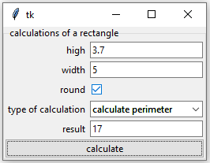

# tkinter_form

tk_form is a simple module that helps you to create forms in tkinter easily and quickly from a base dictionary, saving certain repetitive tasks in the creation of a form and adding the verification of integer and float variables. In simple words it is similar to having a tkinter variable. Its value is a dictionary.

## Install

```bash
pip install tkinter_form
```

## Tutorial

### FULL Example

Esto es un ejemplo de toda las funcionalidades de tkinter-form y de como simplifica la creación de formularios con tkinter. Y obliga a solo centrarse en la lógica del programa.

```python
import tkinter as tk
from tkinter.messagebox import showerror
from tkinter_form import Form, Value, FieldForm


def greater_zero(value):  # funcition validation
    return 20 > value > 0


# seccion que contiene la declaración de la interfaz y parte visual de la misma
estruct = {  # struct form
    "type_calc": Value(["area", "perimeter"], ""),
    "values": {
        "side_1": Value(0.0, "side 1"),
        "side_2": Value(0.0, "side 2"),
    },
    "round": Value(True, ""),
    "decimals": Value(0, ""),
    "result": Value("", ""),
}

EN_FORM = {  # english interface form
    "__form__": "calculations of a square",
    "values": {
        "__form__": "values",
        "side_1": "side 1",
        "__description__side_1": "height",
        "side_2": "side 2",
        "__description__side_2": "width",
    },
    "type_calc": "type of calculation",
    "__list__type_calc": ["area", "perimeter"],
    "round": "round",
    "decimals": "decimals",
    "__description__decimals": "number of decimals",
    "result": "result",
    "__button__": "calculate",
}
EN_LANG = {  # english form select languaje
    "__form__": "select languaje",
    "select_lang": "",
}

ES_FORM = {  # Spanish interface lenguaje
    "__form__": "calculos de un cuadrado",
    "values": {
        "__form__": "valores",
        "side_1": "lado 1",
        "__description__side_1": "altura",
        "side_2": "lado 2",
        "__description__side_2": "ancho",
    },
    "type_calc": "tipo de calculo",
    "__list__type_calc": ["área", "perimetro"],
    "round": "redondear",
    "decimals": "decimales",
    "__description__decimals": "número de decimales",
    "result": "resultado",
    "__button__": "calcular",
}

ES_LANG = {  # espanish select languaje form
    "__form__": "seleccione el lenguaje",
    "select_lang": "",
}

VALIDATE = {  # validation form with regex or functions
    "values": {
        "side_1": r"(?=.*[1-9])^[0-9]*\.?[0-9]*$",
        "side_2": greater_zero,
    },
    "decimals": r"^[0-9]+$",
}


# section that contains the main object of the interface and only contains operating logic
class App(tk.Tk):

    def __init__(self):
        super().__init__()

        self.languaje = Form(  # First form for select languaje
            master=self,
            name_form="languaje",
            form_dict={"select_lang": ["english", "español"]},
        )
        self.languaje.pack(fill="both")

        self.form = Form(  # Second form for logical
            master=self,
            name_form="Calculos de un cuadrado",
            form_dict=estruct,
            name_button="calculate",
            button_command=self.calculate,
        )
        self.form.pack(fill="both")
        self.form.fields["result"].widget.configure(state="disabled")

        self.form.validation(
            VALIDATE, full_validation=True, if_validation_false=self.if_not_validate
        )
        self.change_lang(None)
        self.__add_binds()
        self.mainloop()

    def __add_binds(self):

        field_lang: FieldForm = self.languaje.fields[
            "select_lang"
        ]  # binds with change values
        field_lang.widget.bind("<<ComboboxSelected>>", self.change_lang)

        field_round: FieldForm = self.form.fields["round"]
        field_round.widget.bind("<ButtonRelease-1>", self.hide_decimal)

    def change_lang(self, _):

        lang = self.languaje.fields["select_lang"].get()

        if lang == "english":
            self.languaje.set_labels_text(EN_LANG)
            self.form.set_labels_text(EN_FORM)

        if lang == "español":
            self.languaje.set_labels_text(ES_LANG)
            self.form.set_labels_text(ES_FORM)

    def hide_decimal(self, _):

        if self.form.fields["round"].get():
            self.form.fields["decimals"].hide()

        else:
            self.form.fields["decimals"].show()

    def calculate(self):

        form = self.form.get()  # obtain values form

        type_calcule = form["type_calc"]
        result = None
        if type_calcule == "area":
            result = form["values"]["side_1"] * form["values"]["side_2"]
        elif type_calcule == "perimeter":
            result = 2 * form["values"]["side_1"] + 2 * form["values"]["side_2"]

        if form["round"]:
            result = round(result, form["decimals"])

        self.form.set({"result": result})

    def if_not_validate(self):

        lang = self.languaje.get()["select_lang"]

        if lang == "english":
            showerror(
                "It is not possible to execute the calculation",
                message="Fields with incorrect values",
            )
        elif lang == "español":
            showerror(
                "No es posible ejecutar el calculo",
                message="Campos con valores incorrectos",
            )


if __name__ == "__main__":

    App()

```

With these lines we create the interface that performs the calculations of area and perimeter of a rectangle. This frees us the declaration of the labels and other objects returning a ttk.LabelFrame with the additional methods set(), get() and the attributes widgets and button.



# Api reference

[Api reference html](api_reference/index.html)
